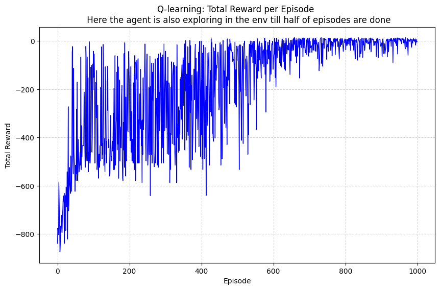

# 🚖 Q-Learning Taxi Agent

This is my implementation of a Q-learning agent for the classic **Taxi-v3** environment.  
The goal is simple: pick up the passenger, drop them off at the right destination, and do it as efficiently as possible.  

---

## 📊 Training Progress

I trained the agent for 1000+ episodes. At first, the rewards were heavily negative (the taxi was basically lost and racking up penalties). Over time, the Q-table updates kicked in, and the agent started to figure things out. Eventually, the rewards stabilized around positive values, which means it learned to complete the task consistently.

Here’s the reward curve during training:



---

## 🎥 Demo

A couple of runs of the trained agent:

- Short GIF preview:  
  

- Full MP4 run:  
  [Watch the video](media/taxi_agent.mp4)

---

## ⚙️ How to Run

Clone the repo and install dependencies:

```bash
git clone https://github.com/aminishereai/Q-Learning-Taxi-Agent.git
cd Q-Learning-Taxi-Agent
pip install -r requirements.txt
